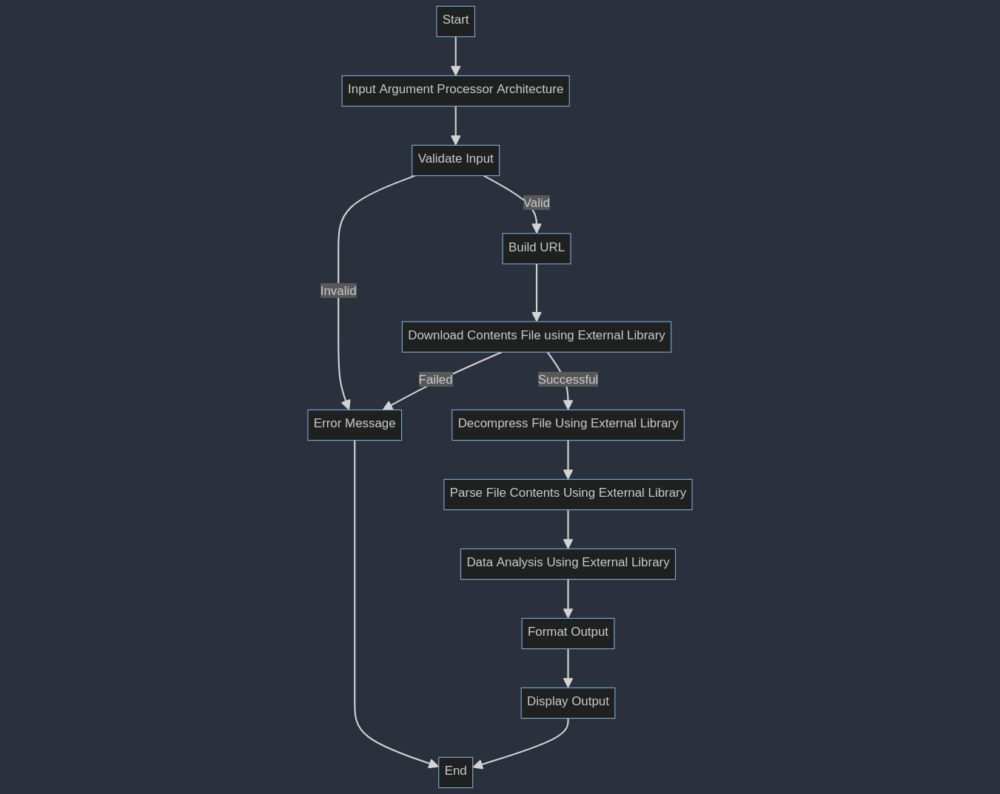

# Canonical Technical Assessment for Embedded & Desktop Linux Systems Engineer 

## 1. Overview

>Input: The tool accepts a processor architecture as an argument (e.g., amd64, arm64, mips).

>Function: It downloads the compressed Contents file associated with the given architecture from a Debian mirror.

>Output: The tool parses the file and displays statistics of the top 10 packages with the most files.


## 2. Thought Process

When working with python, there are a vast number of libraries available to help out with any given task.

My initial thoughts towards the assessment was about chosing between 2 different approaches:

### Approach 1: Using Built-in Libraries

    Pros:
        No External Dependencies: Relies only on Python's standard libraries.
        Simplicity: Easier to understand and maintain.

    Cons:
        Limited Features: May lack advanced functionalities provided by external libraries.
        Potentially More Code: Might require more code to handle tasks like file downloading and decompression.

### Approach 2: Utilizing External Libraries (e.g., Requests, Beautiful Soup, Pandas)

    Pros:
        Ease of Use: Libraries like Requests simplify web scraping and file downloading.
        Powerful Data Handling: Libraries like Pandas can efficiently process and analyze data.
        Rich Features: Offers more functionality and can handle complex tasks easily.

    Cons:
        Dependency Management: Requires managing external dependencies.

I opted with the second approach: Utilizing external libraries, the decision was driven by the need for automation, ease of use out-of-the-box, and shareability across different systems. This approach leverages the power of well-established Python libraries such as requests for efficient web scraping, BeautifulSoup or lxml for advanced parsing capabilities, and pandas for robust data analysis and manipulation.

The following flowchart was then devised to both represent my thoughts into tackling the issue as well as to provide guidance to both implementations and document the overall idea:



With a clear understanding of the starting point and approach for this problem, I have decided to employ a procedural programming approach. This decision is based on the nature of the task, which appears to be a small, one-off script. In this context, procedural programming is well-suited due to its straightforward, function-driven nature.

Should the project's requirements evolve to necessitate more complex interactions, such as intra-accessible calls or managing access queues, transitioning to an object-oriented approach with the use of classes would be advantageous. This shift would allow for better encapsulation of data and functionalities, making the code more adaptable and maintainable for larger or more intricate tasks.

>Overall Implementation was tested with python 3.10.12

## 3. How to run

1. Clone this repository.
2. Open a terminal in the cloned folder.
3. Run the following command:
```
$ python package_statistics.py <desired architechture>
```

This command will check if the repository located at http://ftp.uk.debian.org/debian/dists/stable/main/ contains any packages for the specified architecture.

If needed, grant permissions to execute with:
```
chmod +x package_statistics.py
```

### Requirements:

This program requires the following libraries to work properly: beautifulsoup4 and request

To use this requirements file, user can run the following command:

```
pip install -r requirements.txt
```

## 4. Estimated completion time
Created the Assesment Workspace at 
>19:13 Nov-17-2023

Finished documenting and creating the git repository at:
>22:12 Nov-17-2023

Total time: 3 Hours